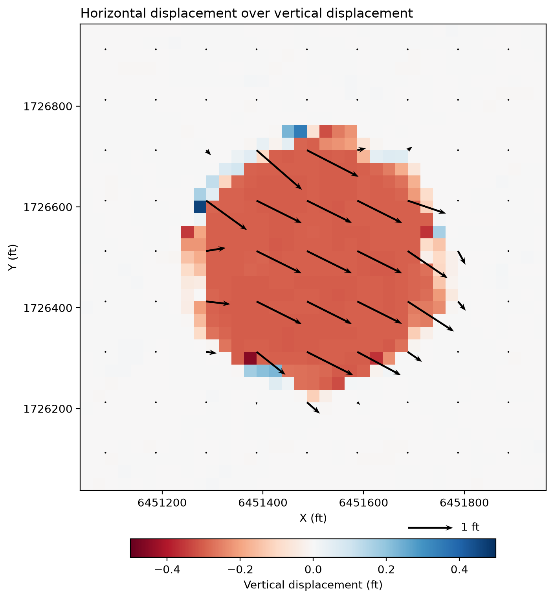

# TICP for 3D Change Detection

Translation-only Iterative Closest Point (TICP) for measuring 3D surface change
between two airborne lidar surveys of the same area.

The two point clouds are split into overlapping windows. In each window a
point-to-plane ICP solves for one shift **(dx, dy, dz)** that moves the earlier
(pre-event) points onto the later (post-event) surface. Because both surveys
are already georeferenced, no rotation is estimated. This keeps the problem small
(3 unknowns per window) and stable, and gives a displacement field over the
whole area. It was developed for monitoring landslides with repeat lidar, but
works for any kind of 3D surface change.

Everything runs on the CPU (no GPU needed). The windows are processed in parallel
on all available cores.


*Test on synthetic data: a circular area moved by (1.0, -0.5, -0.3) ft between the two
"surveys". Colors show dz and arrows show the horizontal shift.*

## How it works

For every window:

1. The pre-event points inside the window are the *moving* points. The post-event
   points inside the window plus a small `margin` are the *fixed* points, with a
   normal vector estimated at every point from its nearest neighbours.
2. Each moving point is paired with its closest fixed point. Its residual is the
   distance to the fixed point's tangent plane, *r = (p + t − q) · n*.
3. Residuals more than `outlier_threshold` × MAD away from the median are rejected
   (vegetation, cars, new structures, ...).
4. The shift update is the least-squares solution of *N·Δt = −r* for the inliers,
   and *t* is updated.
5. Steps 2–4 are repeated until every component of Δt is below `convergence`, or
   `max_iter` is reached.

The result for the window is written at the window center. Windows are spaced
`step_size` apart, so with `window_size = 150` and `step_size = 25` neighbouring
windows overlap a lot and the output raster has a 25-unit pixel size.

## Installation

Python 3.10 or newer. Using a virtual environment:

```bash
python -m venv ticp
ticp\Scripts\activate
pip install -r requirements.txt
```

(on Linux/macOS use `source ticp/bin/activate`)

LAS and LAZ files are read with [laspy](https://laspy.readthedocs.io), so the
steps above are enough for them. To read an Entwine point tile (`ept.json`) or
other formats you also need [PDAL](https://pdal.io). PDAL cannot be installed
with pip on Windows, so use conda:

```bash
conda install -c conda-forge python-pdal
```

## Usage

The inputs are two (or more) point clouds of the same area in the same projected
coordinate system. All sizes (window, step, margin) and all results are in the
units of that system (feet for US State Plane, meters for UTM).

### From the command line

```bash
python main.py before.laz after.laz --window 150 --step 25 --classes 2
```

More than two point clouds in time order are processed pair by pair
(1 → 2, 2 → 3, ...):

```bash
python main.py survey_0906.laz survey_0925.laz survey_1018.laz --window 150 --step 25
```

Run `python main.py --help` for all options.

### From Spyder (or any other IDE)

Open `main.py`. The parameters are at the top of the file:

```python
''' ------------------------ Set the following parameters ------------------------ '''
POINT_CLOUDS = [
    r'D:\Data\before.laz',
    r'D:\Data\after.laz',
]
OUTPUT_DIR = 'results'
...
WINDOW_SIZE = 150
STEP_SIZE = 25
CLASSES = [2, 6, 8]
...
N_WORKERS = None              # None = all cores but one. Use 1 to debug in the IDE
PLOT = False                  # True = quick plot of the results at the end (handy in Spyder)
```

Change them and run the file (F5). Make sure Spyder's working directory is the
repository folder (*Run → Configuration per file → Working directory*). Anything
you add in *Command line options* in the same dialog overrides the values in the
file, exactly like on the command line.

If you want to step through the code with the debugger, set `N_WORKERS = 1` so
everything runs in the main process.

### Parameters

| Parameter | Default | Description |
|---|---|---|
| `WINDOW_SIZE` | 150 | Size of the square ICP window. It must contain enough terrain relief in different directions to constrain dx and dy (see the notes below). |
| `STEP_SIZE` | 25 | Distance between window centers. This is the pixel size of the output raster. |
| `MARGIN` | 3 | Buffer added around the post-event window so the moving points still find neighbours after they are shifted. Should be larger than the largest displacement you expect. |
| `CLASSES` | `[2, 6, 8]` | LAS classes to use (e.g. 2 = ground, 6 = building). `None` uses all points. |
| `MIN_POINTS` | 20 | Windows with fewer points (or fewer inliers) are left empty. |
| `CONVERGENCE` | 0.0005 | ICP stops when all components of the last update are below this. |
| `MAX_ITER` | 20 | Maximum number of ICP iterations per window. |
| `OUTLIER_THRESHOLD` | 3 | Residuals further than this many MADs from the median are rejected. |
| `NORMAL_KNN` | 8 | Number of neighbours used to estimate the post-event normals. Normals stored in the file (`NormalX/Y/Z`) are used when present. |
| `BOUNDS` | `None` | `[xmin, xmax, ymin, ymax]` to process only part of the area. By default the overlap of the two clouds is used. |
| `N_WORKERS` | `None` | Number of processes. `None` uses all cores but one. |
| `CRS` | `None` | CRS of the output raster, e.g. `'EPSG:6424'`. By default it is read from the post-event point cloud. |

### Output

For each pair, two files are written to `OUTPUT_DIR`, named
`<prefix><before>_to_<after>_<window>_<step>`:

- **`.txt`**: one line per window with `X Y dx dy dz rmse n_points` (X, Y = window center)
- **`.tif`**: a GeoTIFF with 4 bands: `dx`, `dy`, `dz`, `rmse`

Windows that could not be solved (no data, too few points, degenerate geometry)
are `NaN`. The displacement is the shift from the earlier to the later survey, so
a negative dz means the surface went down.

## Post-processing tools

Both scripts in `tools/` also have their parameters at the top for use in Spyder,
and take the same values as command-line arguments.

**`tools/remove_bias.py`** subtracts a constant (dx, dy, dz) from the result. Two
surveys are rarely aligned perfectly, and the leftover offset shows up in every
window. Measure it over an area you know did not move and pass it as `--offsets`.
Without offsets the median of each band is used, which is fine when most of the
area is stable. Values that are still larger than `--max-abs` afterwards are set
to NaN. Writes `<name>_norm.tif`.

```bash
python tools/remove_bias.py results/ticp_0925_to_1018_150_25.tif --offsets 0.27 -0.47 -0.07
```

**`tools/plot_displacement.py`** makes the map above: dz as colors and
block-averaged horizontal arrows on top. It saves a PNG next to the raster, and
with `--kml` also a KML overlay you can open in Google Earth.

```bash
python tools/plot_displacement.py results/ticp_0925_to_1018_150_25_norm.tif --block 10 --dz-limit 2 --kml
```

## Notes and limitations

- **Flat terrain cannot constrain horizontal motion.** If all normals in a window
  point up (a flat field, a parking lot), dx and dy are undetermined and the
  result is noisy. Buildings, breaklines and slopes in the window help. Larger
  windows are more stable but average more of the motion.
- A window straddling the edge of a moving area gets a mix of both motions, so
  boundaries look smoothed over roughly one window size.
- Only a translation is estimated. If a block rotates within a window, the
  result is the average shift.
- The whole point cloud is held in memory. For very large surveys, split the area
  with `BOUNDS` and run it in parts.

## Repository layout

```
main.py                     parameters and entry point
icp.py                      the TICP algorithm and the moving-window processing
utilities.py                reading point clouds, normals, writing results, quick plot
tools/remove_bias.py        remove a constant offset from a result raster
tools/plot_displacement.py  map of dz with dx/dy arrows, optional KML
```

Earlier experiments (PDAL's `filters.icp` and full rigid ICP with Open3D) are no
longer part of the code but can be found in the git history.

## Author

Nima Ekhtari, National Center for Airborne Laser Mapping (NCALM), University of Houston
